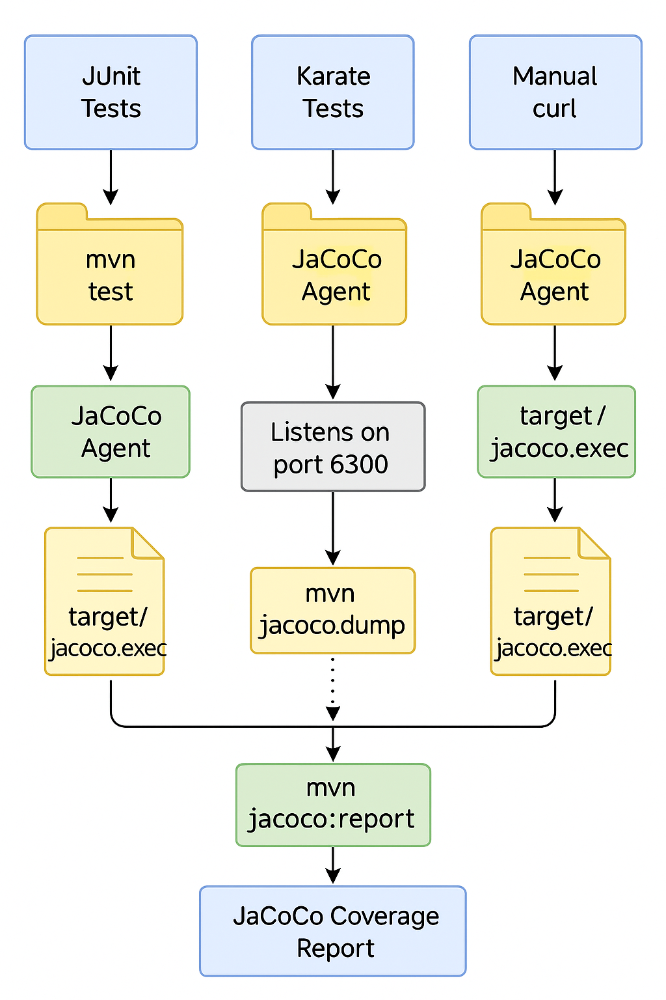

# Spring Boot + Karate API + JaCoCo Coverage Demo

This project demonstrates how to:

- Build a simple Spring Boot REST API
- Test it using [Karate DSL](https://karatelabs.io/)
- Capture code coverage using [JaCoCo](https://www.jacoco.org/jacoco/)
- Merge API test coverage and unit test coverage into one report

---

## 📦 Prerequisites

- Java 17 or 21
- Maven 3.6+
- Karate (bundled via Maven)
- JaCoCo Agent JAR: included in `jacoco-agent/`

---

## 🚀 How to Run the Project

### Single Script:

I now use a single script to automate the workflow

```bash
./collect-coverage.sh
```

This script will:

- Clean and build the Spring Boot app
- Start the Spring Boot app with the JaCoCo agent
- Run Karate tests while the app is running
- Dump execution data from JaCoCo agent
- Generate a coverage report

🧪 About the Tests
Karate tests are located under:

```
src/test/java/features/*.feature
```

These include scenarios that call Spring Boot endpoints like:

/hello/formal
/hello/informal
/hello/status/{code}
/hello/echo

This illustrates that another test runner, such as Karate or Katalon, can drive the code coverage, and the results data can be combined with JUnit results in a single jacoco.exec file. We can then generate a report off of this combined jacoco.exec that shows coverage from multiple test runners.

### Manual Steps:

### 1. Build the Application

```bash
mvn clean package
```

### 2. Start the server with JaCoCo coverage recording enabled via TCP:

### Keep this process running while you run tests.

```
java -javaagent:jacoco-agent/org.jacoco.agent-0.8.11-runtime.jar=output=tcpserver,address=*,port=6300 \
  -jar target/spring-karate-0.0.1-SNAPSHOT.jar
```

### 3: Run Karate API Tests

In a new terminal:

```
mvn test -Dtest=features.KarateTest
```

### 4: Dump JaCoCo Coverage from Running App

```
mvn jacoco:dump
```

This saves coverage data to:
target/jacoco.exec

### 5: Merge Unit + Karate Coverage

### 6: Generate Final Report

```
mvn jacoco:report
```

### 7: Open the combined report under:

target/site/jacoco/index.html

## Additional Info:

### Coverage Sources Summary

| Source       | Trigger Command                  | JaCoCo Output File   | Notes                                  |
| ------------ | -------------------------------- | -------------------- | -------------------------------------- |
| JUnit Tests  | `mvn test`                       | `target/jacoco.exec` | Uses `prepare-agent`                   |
| Karate Tests | `mvn test -Dtest=...`            | `target/jacoco.exec` | Requires app running with JaCoCo agent |
| Manual curl  | `curl http://localhost:8080/...` | `target/jacoco.exec` | Must run `mvn jacoco:dump` after curl  |


